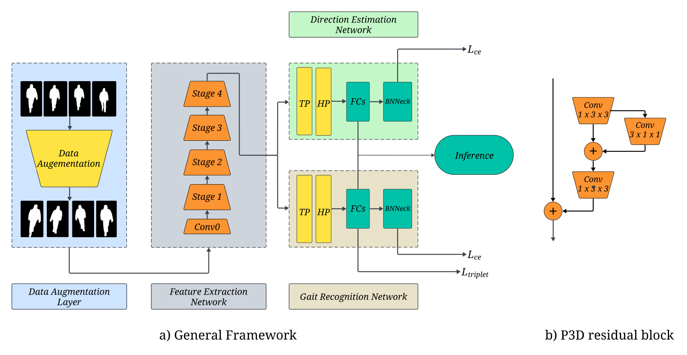

# MTGait: A Multi-Task Learning Framework for Unified Gait Recognition and Walking Direction Analysis

## Get Started

### Installation and Setup
1. Download and upzip this file.
2. Install dependenices 
`pip install tqdm pyyaml tensorboard opencv-python kornia einops` 
`pip install torch==1.10 torchvision==0.11`

### Download and prepare dataset

1. Download the CASIA-B dataset: http://www.cbsr.ia.ac.cn/GaitDatasetB-silh.zip
2. Run python script to convert it into pickle file `python data/pretreatment.py --input_path CASIA-B --output_path CASIA-B-pkl`

### Train the model

`python main.py --cfgs ./config/setup.yaml --phase train`

* --cfgs The path to config file.
* --phase Specified as train.

NOTE: Make sure to update the dataset_root path in `./config/setup.yaml`. 

### Test the model

1. For evaluating the gait recognition task: 
`python main.py --cfgs ./config/setup.yaml --phase test --eval_type recognition`
2. For evaluating the walking direction estimation task: 
`python main.py --cfgs ./config/setup.yaml --phase test --eval_type direction`

* --cfgs The path to config file.
* --phase Specified as test.
* --eval_type Specfies the evaluation type

This codebase uses support modules modified from OpenGait: https://github.com/ShiqiYu/OpenGait/tree/master.

